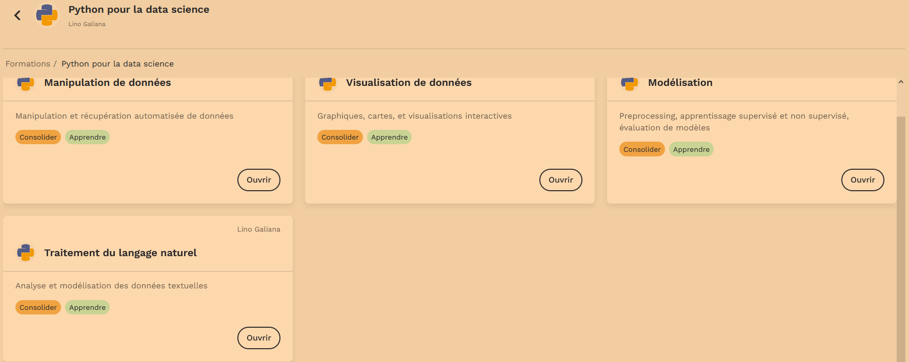

```{r setup, include=FALSE}
options(htmltools.dir.version = FALSE)
```


# Présentation catalogue `r fontawesome::fa("fab fa-python", fill = "white")`
## Catalogue (1/2)

**1. Modules d'autoformation sur [sspcloud.fr/documentation](https://www.sspcloud.fr/documentation);**

+ Notebooks pédagogiques, différents niveaux accessibles
+ Environnements normalisés: pas de problèmes d'installation de *packages*
+ Formation aux bonnes pratiques: modularité, contrôle de version, stockage séparé du code

--

**2. Ressources `Python` `r fontawesome::fa("fab fa-python")` (et `Git` `r fontawesome::fa("fab fa-git-alt")`):**

+ Initiation à Python sur [sspcloud.fr/documentation](https://www.sspcloud.fr/documentation) ;
+ Perfectionnement avec le cours de [2A ENSAE "Python pour data scientists et économistes"](https://linogaliana-teaching.netlify.app/) [`r emo::ji("zoom")`](#python)
    
---
# Présentation catalogue `r fontawesome::fa("fab fa-python", fill = "white")`
## Catalogue (2/2)

**3. Ressources `R` (et `Git` `r fontawesome::fa("fab fa-git-alt")`):**

+ Formations sur des points plus spécifiques. ex: [Travail collaboratif avec R](https://linogaliana.gitlab.io/collaboratif/)
+ `utilitR`: environnement normalisés pour tester les exemples de la documentation
+ Autres ressources `R``r fontawesome::fa("fab fa-r-project")`
ou `Python` `r fontawesome::fa("fab fa-python")`


---
name: python
# Ressources `r fontawesome::fa("fab fa-python", fill = "white")`: cours de l'ENSAE

[https://linogaliana-teaching.netlify.app/](https://linogaliana-teaching.netlify.app/)
([dépôt `r fontawesome::fa("fab fa-github")`](https://github.com/linogaliana/python-datascientist))
<br><br> 

**Un parcours complet pour la _data-science_** :

+ Manipulation et structuration de données ;
+ Visualisation ;
+ Modélisation (économétrie et _machine learning_) ;
+ Données textuelles (NLP) ;
+ `Git` `r fontawesome::fa("fab fa-git-alt")` et `Github` `r fontawesome::fa("fab fa-github")`.

[Les notebooks sont ici](https://www.sspcloud.fr/formation?search=&path=%5B%22Python%20pour%20la%20data%20science%22%5D)
```{r, echo = FALSE, out.width = "60%", fig.align = "center"}

```


---
# Ressources `r fontawesome::fa("fab fa-python", fill = "white")`: cours de l'ENSAE

[https://linogaliana-teaching.netlify.app/](https://linogaliana-teaching.netlify.app/)
([dépôt `r fontawesome::fa("fab fa-github")`](https://github.com/linogaliana/python-datascientist))
<br><br> 

**Introduire à la philosophie de la data-science** :

+ Reproductibilité et pérennité des projets
+ Versioning et partage des codes
+ Réduction des coûts de mise en prod
<br><br>

--

**Mise à disposition tutoriels et exercices facilitée**:

```{r, echo = FALSE}
knitr::include_graphics("badges.png")
```

- [Page en question: https://linogaliana-teaching.netlify.app/webscraping/](https://linogaliana-teaching.netlify.app/webscraping/)
- [Accès SSPCloud](https://www.sspcloud.fr/formation?search=&path=%5B%22Python%20pour%20la%20data%20science%22%2C%22Manipulation%20de%20donn%C3%A9es%22%5D)

---
name: deploiement
# Comment déployer sur le `SSPCloud` ?
## Pourquoi ?

- Des notebooks sont disponibles sur `Github` `r fontawesome::fa("fab fa-github")` <br> ([exemple](https://github.com/linogaliana/python-datascientist/blob/master/notebooks/course/NLP/01_intro.ipynb))

--
- Objectifs:
    + permettre aux personnes intéressées de tester les exemples/exercices dans un environnment Jupyter
    + contrôler l'environnement d'exécution pour éviter les problèmes d'installation
<br>

--
- Solution: déploiement automatique sur le SSPCloud

---
# Comment déployer sur le `SSPCloud`
## Avantages

- Pour les formés:
    + Pas d'installation d'Anaconda, Jupyter, modules Python sur Windows, etc.
    + Très simple d'usage : un click et on a un notebook opérationnel

--

- Pour les formateurs:
    + Plus à gérer plusieurs configurations ou des spécificités propres à chaque OS ou poste de travail
    + Possibilité d'associer ça à l'intégration continue pour tester la reproductibilité

--

- Challenge:
    + Mise en place assez exigeante initialement...
    + ... mais gains de confort rapidement

---
# Comment déployer sur le `SSPCloud` ?
## Contrôler la portabilité de sa formation (1/2)

- L'idéal est que les formés aient un environnement prêt à l'emploi:
    + Un environnement de développement avec des modules adéquats (auto-complétion, Gitlens...)
    + Pas de dépendance à installer..
    + ... ou installation facile de celles-ci
  
--

- Pour les formés, possibilité de sauvegarder les codes avec `Git`
`r fontawesome::fa("fab fa-git-alt")`
(formation aux bonnes pratiques par l'usage)


---
# Comment déployer sur le `SSPCloud` ?
## Contrôler la portabilité de sa formation (2/2)

<br><br>
- Construire une image `Docker` `r fontawesome::fa("fab fa-docker")` qui contient les éléments minimaux pour pouvoir
démarrer :
    + Exemple `Python` `r fontawesome::fa("fab fa-python")`: un environnement `Anaconda` prêt à l'emploi ;
    + Exemple `R` `r fontawesome::fa("fab fa-r-project")`: dépendances listées (ou préinstallées) dans un fichier `Description`

--
- Chaque `commit` sur `Github` `r fontawesome::fa("fab fa-github")` permet de mettre à jour les notebooks disponibles
dans le catalogue

---
name: retex
# Retour d'expérience de l'ENSAE

<br><br>
- Plus à galérer entre les étudiants utilisant les postes de l'ENSAE et
ceux ayant leur propre ordinateur ;
- Installation des modules très pratique (merci Linux `r fontawesome::fa("fab fa-linux")` !) ;
- Beaucoup de ressources RAM et CPU sur SSPCloud (vs réseau ENSAE) ;
- Formation à Git `r fontawesome::fa("fab fa-git-alt")` par l'usage
